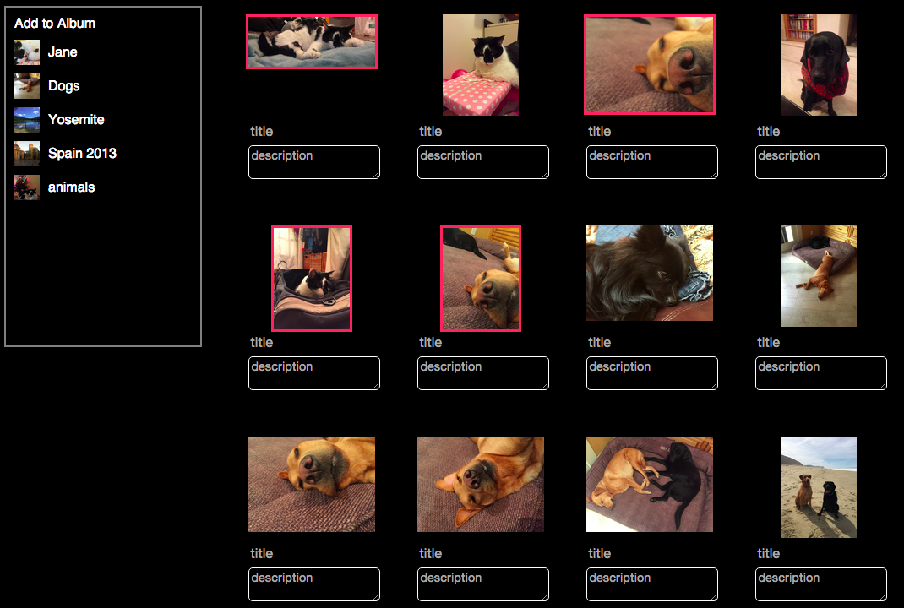

# Pixie
A clone of Flickr built on Rails and Backbone

[pixie]: http://www.pix-ie.xyz

# Features

<!-- This is a Markdown checklist. Use it to keep track of your progress! -->

- Create an account
- Sign in
- Sign in using Facebook
 

- Upload single photos to their photostream
 

- Create albums
 

- Upload multiple photos and assign them to albums
 

- View Photostreams, Albums, and Favorites Pages
- Favorite a photo
- Comment on a photo
- Follow another user

# Technologies
- Ruby
- Javascript
- HTML
- CSS

# Frameworks
- Rails
- Backbone

# Libraries
- Paperclip
- AWS
- OmniAuth
- jBuilder
- JQuery
- Underscore
- JQuery UI Draggable
- JQuery UI Droppable
